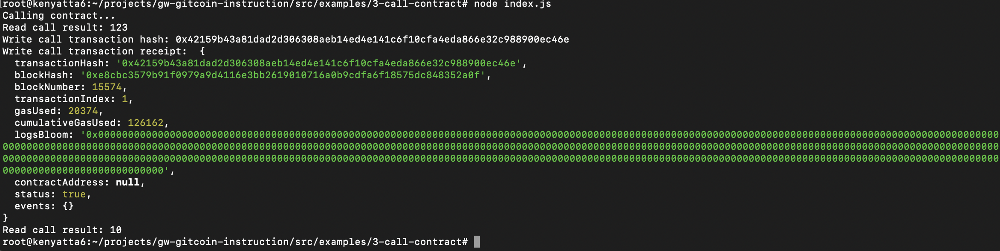

## 1. A screenshot of the console output immediately after you have successfully issued a smart contract call.

## 2. The transaction hash from the console output (in text format).
0x42159b43a81dad2d306308aeb14ed4e141c6f10cfa4eda866e32c988900ec46e
## 3. The contract address that you called (in text format).
0x50697729269A8bb74EDC303f4033358441dF60BC
## 4. The ABI for contract you made a call on (in text format).
```json
[
    {
      "inputs": [],
      "stateMutability": "payable",
      "type": "constructor"
    },
    {
      "inputs": [
        {
          "internalType": "uint256",
          "name": "x",
          "type": "uint256"
        }
      ],
      "name": "set",
      "outputs": [],
      "stateMutability": "payable",
      "type": "function"
    },
    {
      "inputs": [],
      "name": "get",
      "outputs": [
        {
          "internalType": "uint256",
          "name": "",
          "type": "uint256"
        }
      ],
      "stateMutability": "view",
      "type": "function"
    }
]
```
