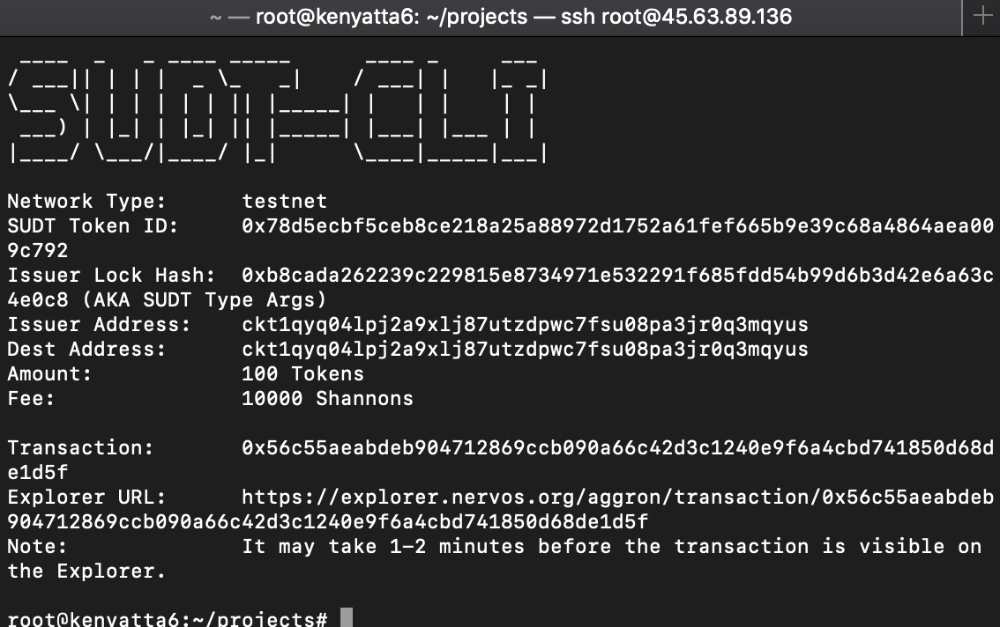
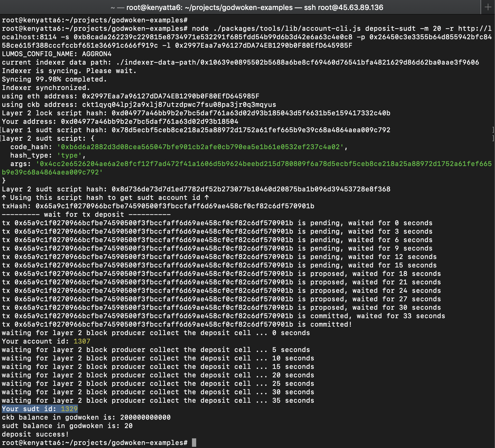

## 1. A link to the Layer 1 address you funded on the Testnet Explorer.
[https://explorer.nervos.org/aggron/address/ckt1qyq04lpj2a9xlj87utzdpwc7fsu08pa3jr0q3mqyus](https://explorer.nervos.org/aggron/address/ckt1qyq04lpj2a9xlj87utzdpwc7fsu08pa3jr0q3mqyus)
## 2. A screenshot of the console output immediately after using sudt-cli to create your SUDT tokens on Layer 1.

## 3. A link to the transaction ID created by sudt-cli on the Testnet Explorer.
[https://explorer.nervos.org/aggron/transaction/0x56c55aeabdeb904712869ccb090a66c42d3c1240e9f6a4cbd741850d68de1d5f](https://explorer.nervos.org/aggron/transaction/0x56c55aeabdeb904712869ccb090a66c42d3c1240e9f6a4cbd741850d68de1d5f)
## 4. A screenshot of the console output immediately after you have successfully submitted a deposit to Layer 2 using the account-cli tool.

## 5. The SUDT ID from the console output after executing the deposit script (in text format).
1329
