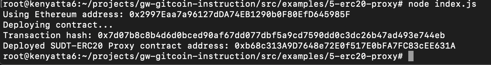
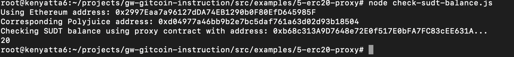

## 1. A screenshot of the console output immediately after deploying smart contract.

## 2. The address of the ERC20 Proxy Contract you deployed (in text format).
0xb68c313A9D7648e72E0f517E0bFA7FC83cEE631A
## 3. A screenshot of the console output immediately after checking your SUDT balance.

## 4. The Ethereum address that was checked (in text format).
0xdF1DF97ad47b2F45C4B2B6C728b90959DC9e75d2
