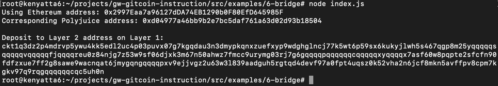

## 1. A screenshot of the console output immediately after you have successfully generated your Deposit Receiver Address.

## 2. Your Deposit Receiver Address (in text format).
ckt1q3dz2p4mdrvp5ywu4kk5edl2uc4p03puvx07g7kgqdau3n3dmypkqnxzuefxyp9wdghglncj77k5wt6p59sx6kukyjlwh5s467qgp8m25yqqqqqsqqqqqvqqqqqfjqqqqreu0z84njg7z53w9sf06djxk3m67n50ahwz7fmcc9urymg03rj7g6gqqqqpqqqqqqcqqqqqxyqqqqx7asf60w8pqpte2sfcfn90fdfzxue7ff2g8sawe9wacnqat6jmygqngqqqqpxv9ejjvgz2u63w3l839aadguh5rgtqd4devf97a0fpt4uqsz0k52vha2n6jcf8mkn5avffpv8cpm7kgkv97q9rqgqqqqqqcqc5uh0n
## 3. The Ethereum address used to generate the Deposit Receiver Address (in text format).
0x2997Eaa7a96127dDA74EB1290b0F80EfD645985F
## 4. A link to the Etherscan explorer for the successful Force Bridge transaction. This can be found on Force Bridge under History→Succeed.
[https://rinkeby.etherscan.io/tx/0x94edb8a5210ab61244c21e21522507bd9e3227d3fd2a5641e8548068782d4d7e](https://rinkeby.etherscan.io/tx/0x94edb8a5210ab61244c21e21522507bd9e3227d3fd2a5641e8548068782d4d7e)
## 5. A link to the Nervos explorer for the successful Force bridge transaction. This can be found on Force Bridge under History→Succeed.
[https://explorer.nervos.org/aggron/transaction/0x235fef62d97a9d2ccc9d8dc85cc4dd814bb78e43c0a045daa2157aca68bc037b](https://explorer.nervos.org/aggron/transaction/0x235fef62d97a9d2ccc9d8dc85cc4dd814bb78e43c0a045daa2157aca68bc037b)
